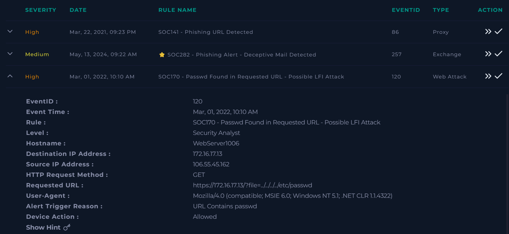
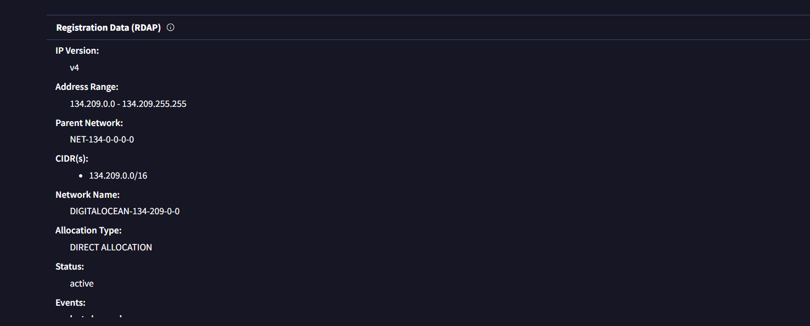
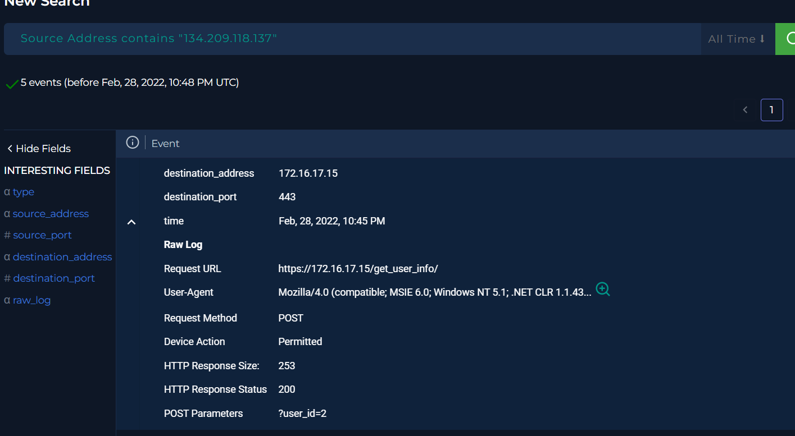
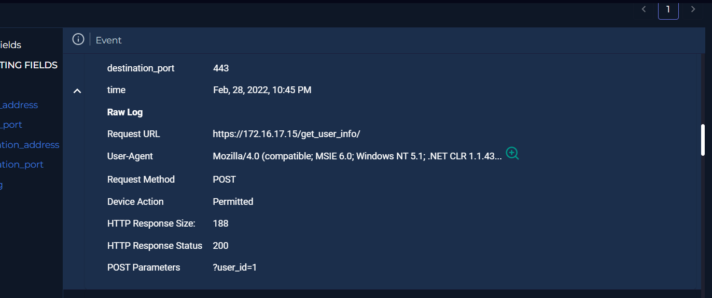
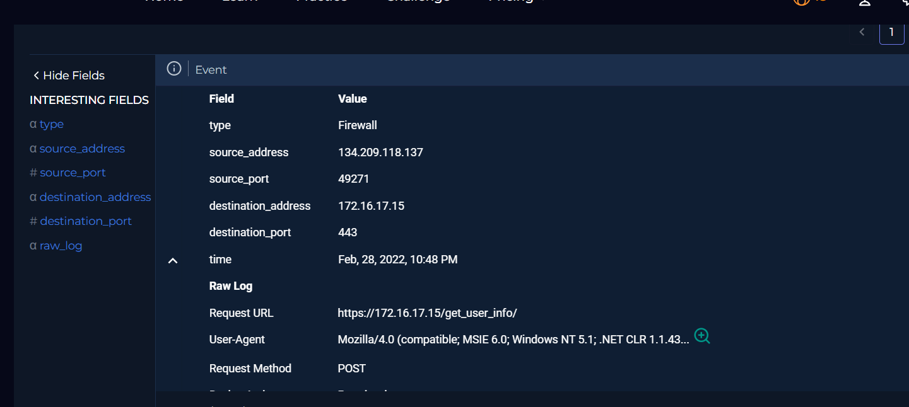
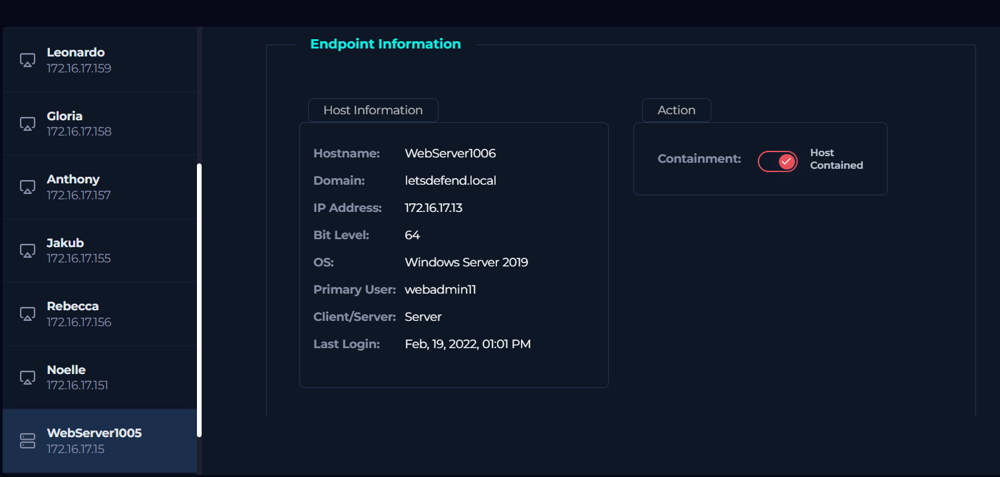
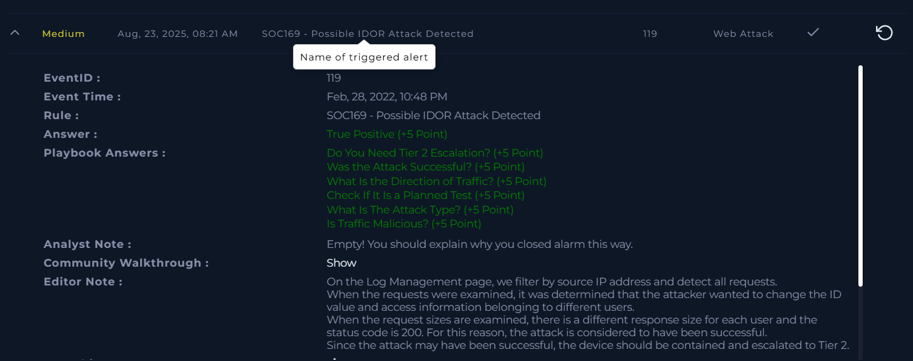

Web attack Alert 2 :

First let us examine the Ip address :

The suspicious IP address was checked against VirusTotal. Only **1/94 vendors flagged it**, which does not strongly indicate malicious activity. However, additional context is important — this IP is hosted on **DigitalOcean**, a provider often abused to run anonymized services and dark web infrastructure.

MITRE Reference

TA0011: Command and Control (C2) → Adversaries frequently use VPS/cloud providers like DigitalOcean to host C2 infrastructure.

But this doesn’t prove anything so we'll carry out log analysis.

The logs clearly show the **`id` parameter being exploited**, while the HTTP response code is **200**, indicating the request was successful. This is a direct red flag that the attack executed without triggering an error response.

We need to immediately pivot to the **Endpoint Detection and Response (EDR)** platform to check for any malicious commands that may have executed on the host. Since the attack has been carried out, the affected device should be **contained** without delay. No escalation is required if the incident is isolated, but containment and deeper EDR analysis are mandatory.

As expected we’ve completed the play book and the analysis is on point .
