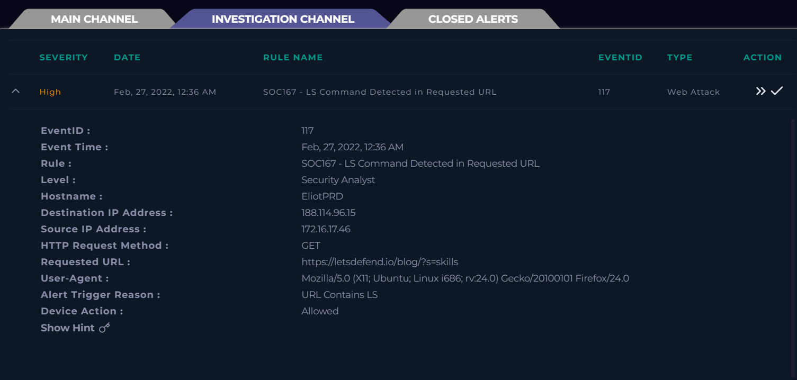
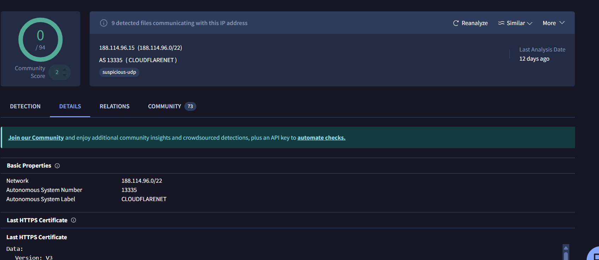
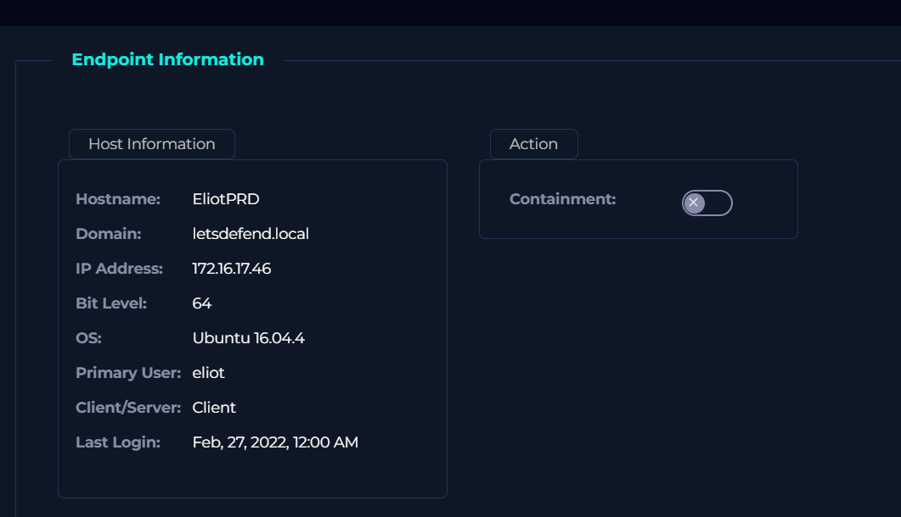
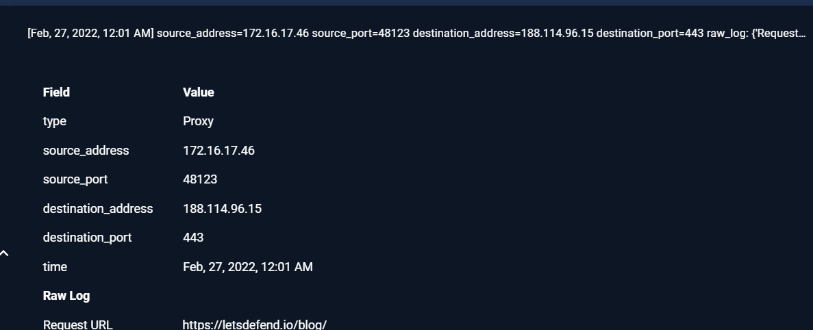
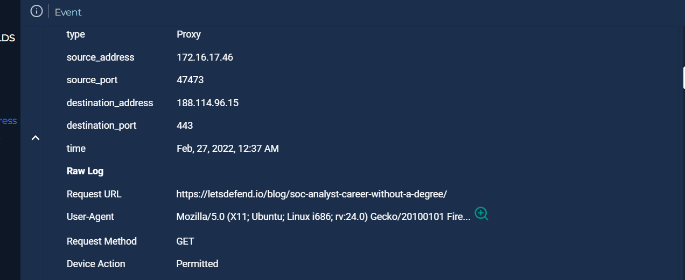
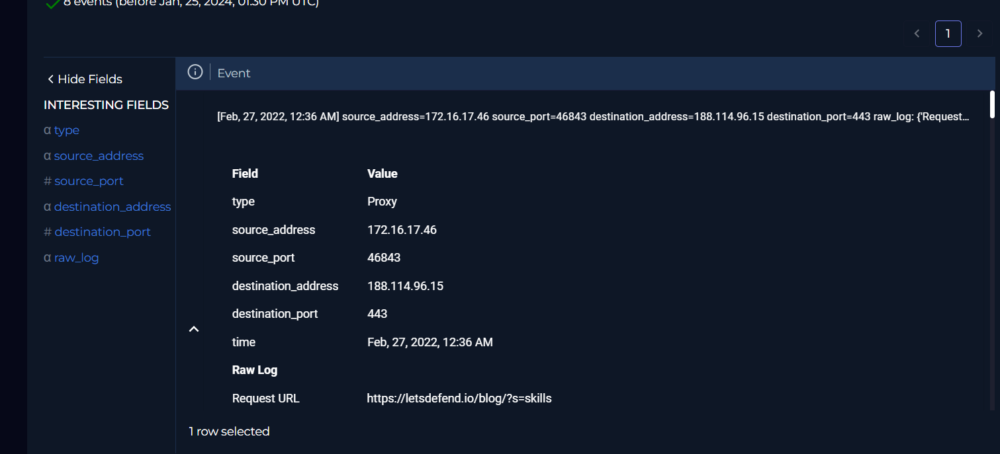
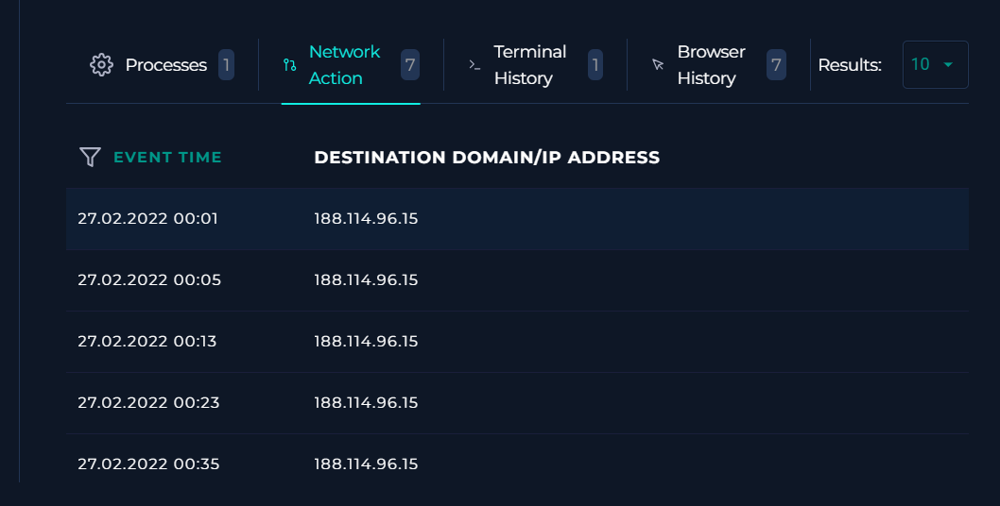
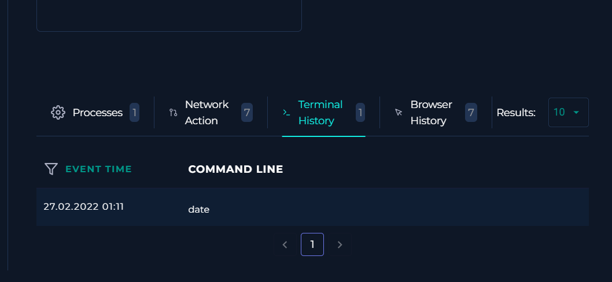

Alert 2 :

This is the scenario here

As usual we will examine the IP on virus total –

Nothing on virus total but this isn’t enough for deducing nothing’s
malicious .

Gathering client details :

The first step is to review the logs associated with the alert. Log inspection helps confirm whether suspicious activity is present and provides context around the event.

- Review web server or application logs for unusual parameters and request patterns.  
- Note any anomalies in the timestamps, HTTP methods, or response codes.  
- Pay attention to query parameters such as `id` or `user`, which are often targeted for exploitation.

If suspicious behavior is observed, pivot into your SIEM to filter and correlate these logs for further investigation.

The attacker first built trust by sending normal, harmless requests. You can see in the logs that the request URLs look completely legitimate at the beginning. This continues until the alert URL shows up — that’s where the malicious activity starts.

.

The request URL with `?s` looks a bit suspicious because it resembles the `ls` command. At first glance it could raise a red flag, but it doesn’t seem to carry malicious intent here. It may have been triggered by something like `skil-'ls'`.  

Let’s move forward and check the process to confirm if anything actually executed.

he EDR logs confirm that there were multiple requests made from the attacker. This verifies that the activity was not just a single anomaly but a repeated attempt, which increases the confidence that the behavior is suspicious.

The terminal history does not show any `ls` command being executed, so nothing suspicious was found at this stage. My earlier assumption that the `?s` parameter was malicious turned out to be incorrect, and I lost points there.

### Lesson Learned
Don’t approach every case with a threat-finding mindset. Instead, treat it as a normal alert first, then escalate only when there is enough evidence to support malicious activity.

