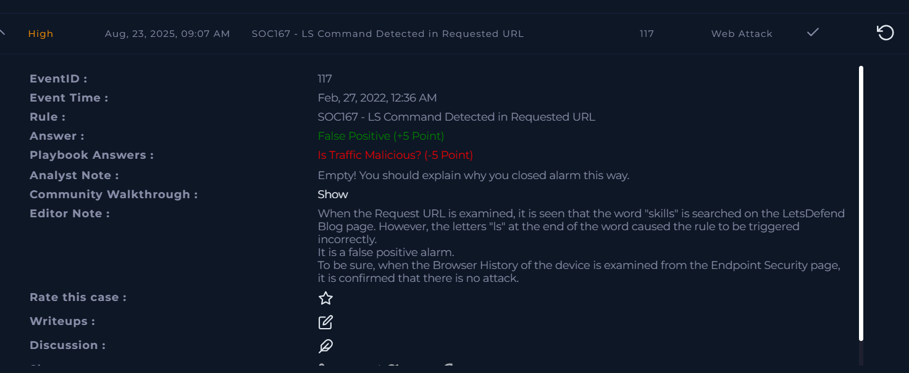

Web Alert 3 :

This is the scenario here

As usual we will examine the IP on virus total –

Nothing on virus total but this isn’t enough for deducing nothing’s
malicious .

Gathering client details :

Let us check the logs now .

Attacker initially established trust with the victim by sending some
legitimate requests without any malice you can see the request urls
being completely normal until the alert Url
.

The request url ?s is kinda suspicious as it looks like ls . But I don’t
think it is with malicious intent as it may be triggered with skil-‘ls’
. Let us check the process

EDR confirming multiple requests .

The terminal history doesn’t show any ls command being executed so I
don’t think anything is suspicious here . But I deduced the ?s to be
malicious so I lost points there .

The lesson from this is don’t have threat finding mindset but rather
look everything as normal alert then escalate .

