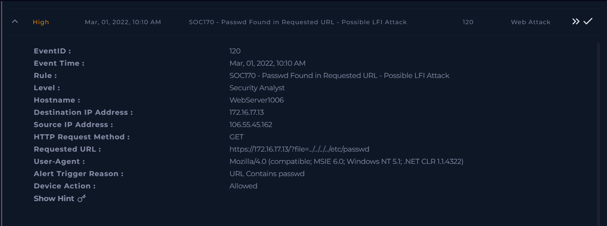
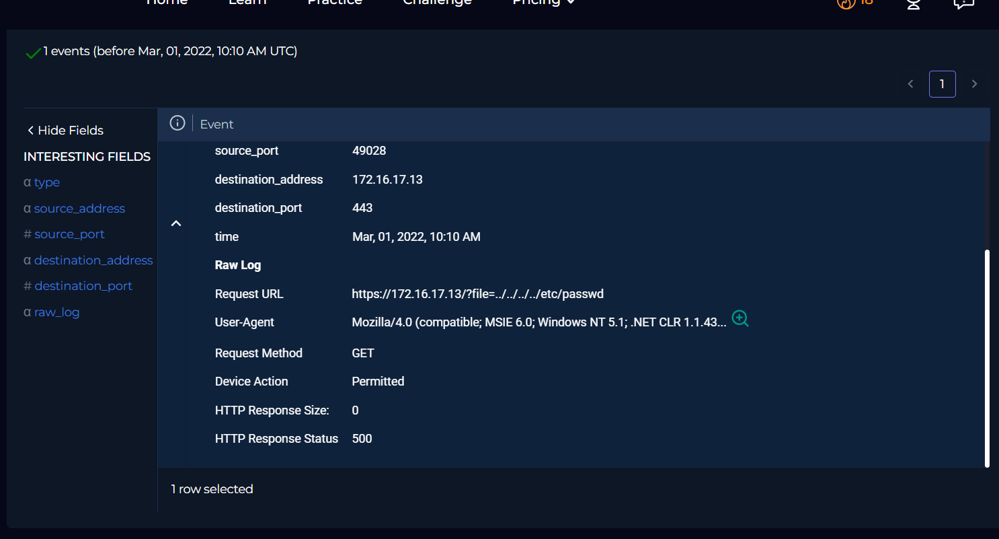
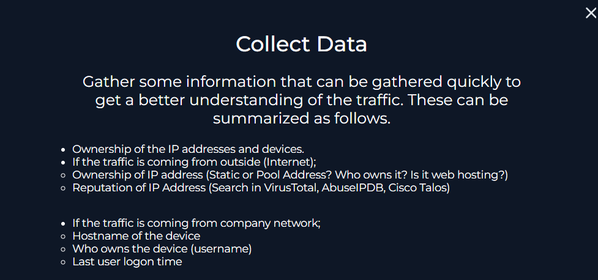
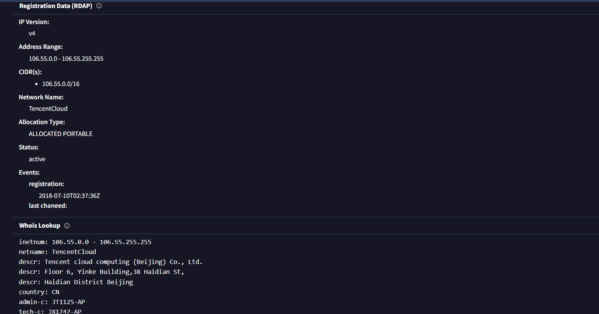
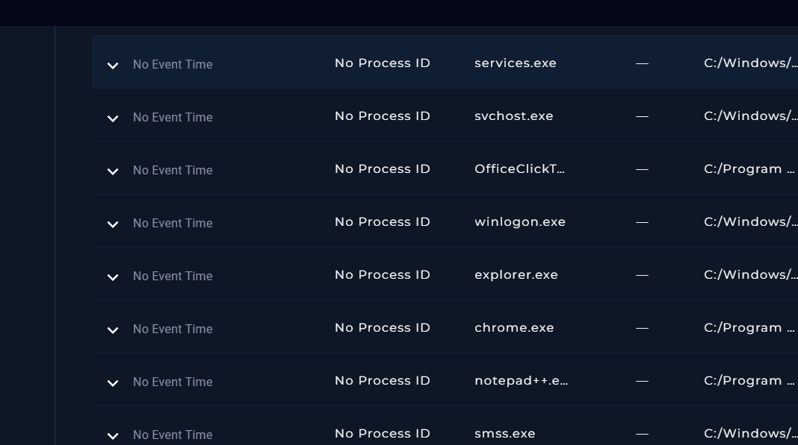
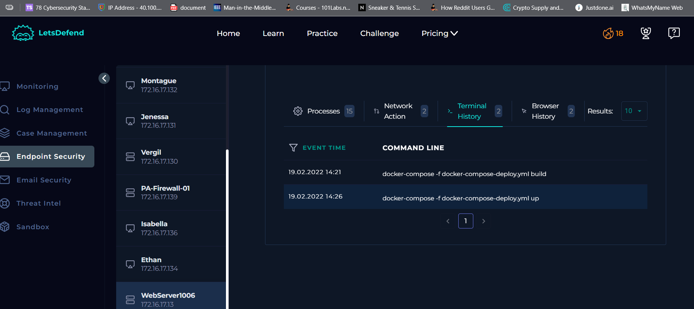
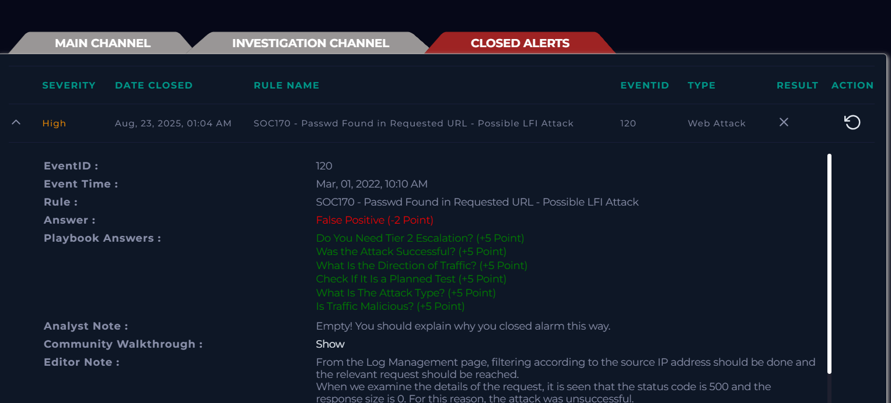

Web attacks Challenge 1 :

We’ve go the source and destination Ips . Let us start with log
management to see if there any additional exchanges between the Ips.

Port 443 says its being communicating through https .

Status code is 500 meaning . **500**: your app/code crashed. So most
probably the attack isn’t successfyk but we should cross check it at
Endpoint detection and check for processes to see if there’s anything
returned . Also the response size is 0 .

Let us look at the request now :

<https://172.16.17.13/?file=../../../../etc/passwd>

This suspicious as a random cloud provider is requesting for
etc/password file going up the heirar

Seems like the source Ip address belongs to a company called Tencent
cloud which is obviously webhosted .

And just 1/94 security vendor flagging .

The destination is a letsdefend.io company webserver owned by
letsdefend.io

The traffic is from the internet .

**Last Login:**

Feb, 19, 2022, 01:01 PM

Now when I check the process , webbrowser history I couldn’t see
anything that is suspicious .

As the suspicion was on Local file inclusion the terminal has to be
accessed to go up or down the hierarchy .

As there is nothing that supports the alert it is not a true positive it
is a false positive as we don’t see anything suspicious .

It was a possible LFI attack but wasn’t successful .
