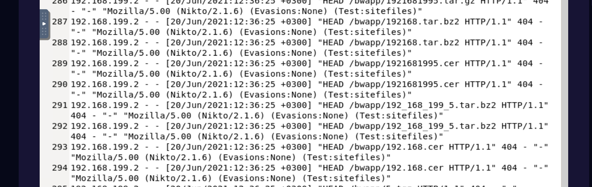

Web attacks – Challenge 2 :

In this challenge I was given an access log to analyze . The first
question was

I found this suspicious as someone is trying to change domain name
extensions like .show,.jave,.dgps but as we can see the response code is
404 so nothing to worry as of now .

The first question asked for automated tool used for reconsiance . I can
see nikito 2.1.6 and searched through the web for it

So its basically a web vulnerability scanner in this case . Using nikito
he used different file extensions to hit a jackpot just in case if there
isn’t clean code .

The attacker is trying to gain access to web directories one by one he
is trying to test different directories hence after reconcssiance this
is probably the first attack that is directory brute force . Clearly see
he is testing out the number in different formats to see if there is any
response .

I see some encoding here let us check . Seems to be directory traversal
attack . This is probably the second attack after brute-forcing .

So this challenge had multiple attacks at once and we’ve solved it .
