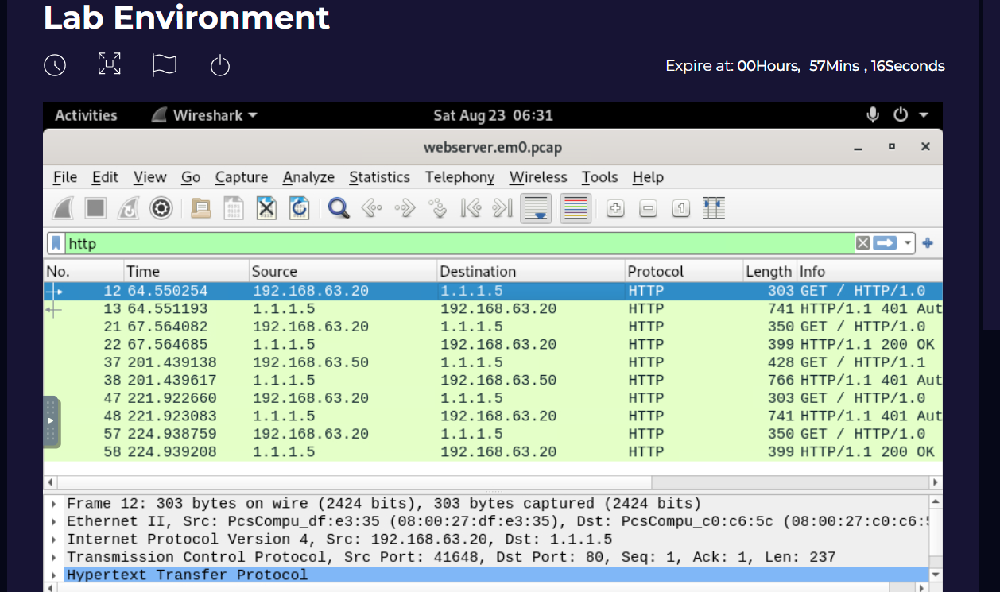
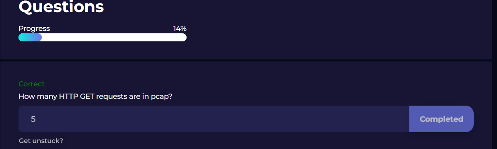
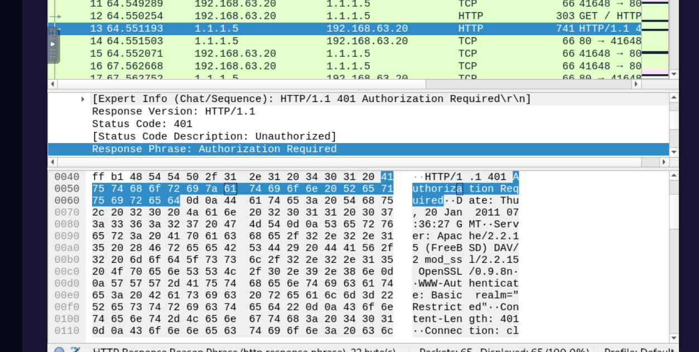
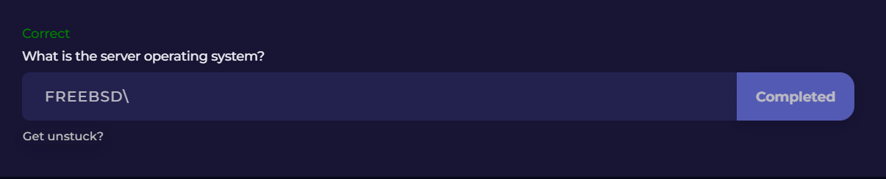
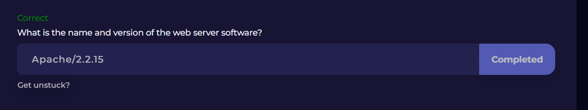
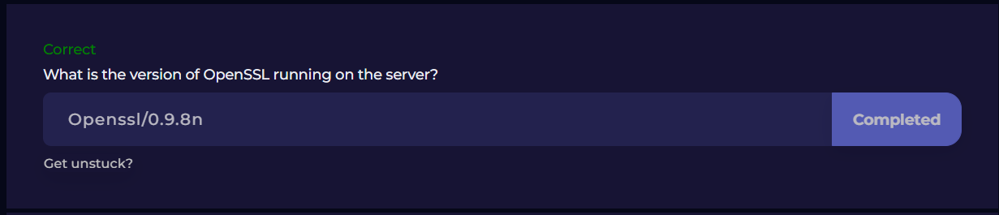
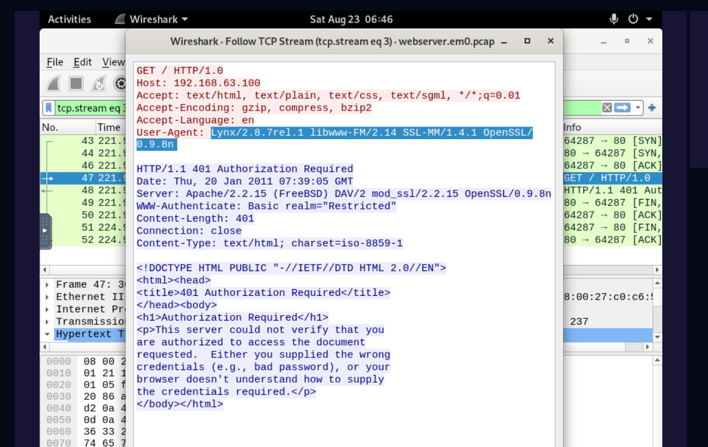
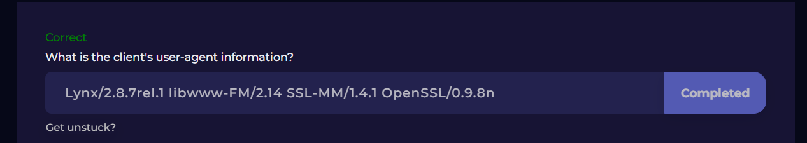
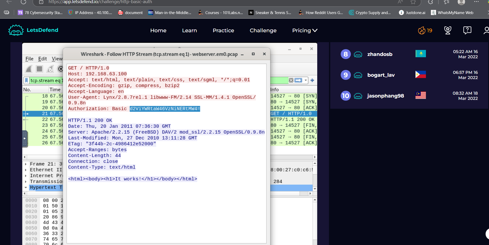
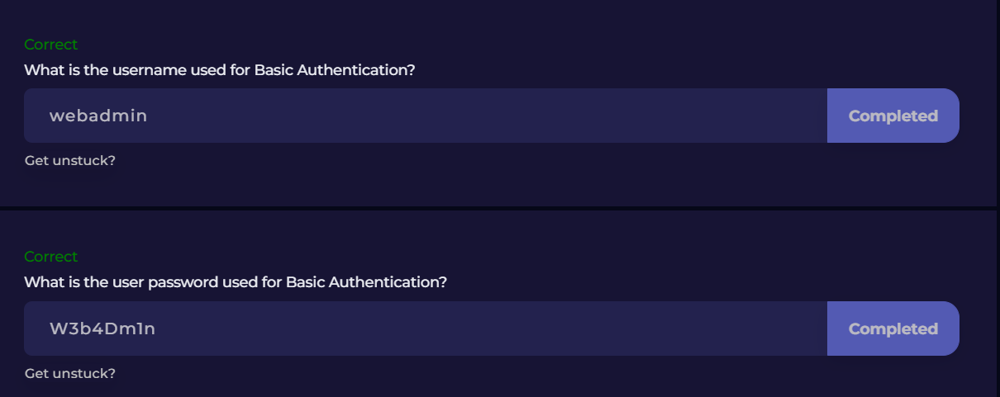

Challenge – HTTP :

The challenge is analyzing a PCAP file. First step is to load it in a tool like Wireshark and get a quick overview — what protocols are present, how many packets, and the capture timeline.  
This sets the baseline for what’s normal and what’s not.
Check out the source and destination IPs and the ports being used. Common web traffic over 80 or 443 isn’t always safe, so filtering in the SIEM helps confirm if those same IPs show up in historical logs.  
This ties into **NIST Incident Response (IR-4: Incident Handling)** — identify potential malicious communications early.
Look for clear red flags:
- HTTP requests with encoded payloads (could point to LFI or SQLi).  
- Attempts to access sensitive paths like `/etc/passwd`.  
- Unusual DNS queries that could signal tunneling.  

These map to **MITRE ATT&CK T1190 (Exploit Public-Facing Application)** and **T1046 (Network Service Scanning)**, depending on the activity.

Once suspicious traffic is spotted, validate it:
- Cross-check in SIEM for matching logs.  
- Correlate timestamps with endpoint data (EDR) to see if anything executed.  
- Confirm if this is a true positive or just noise.  

The string `d2ViYWRtaW46VzNiNERtMW4=` is just **Base64**. Decoding it gives

webadmin:W3b4Dm1n

That’s a username/password combo. If this shows up in logs or traffic, treat it as sensitive. Base64 isn’t encryption — it’s just an encoding. Attackers know how to run `base64 -d` in a second, so hiding creds like this is pointless.

